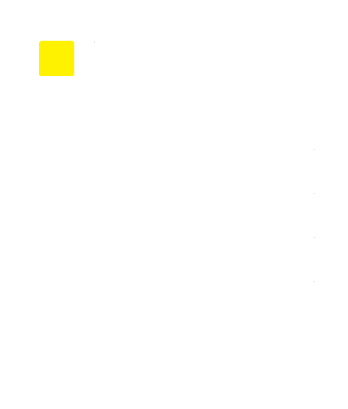

<!-- Improved compatibility of back to top link: See: https://github.com/othneildrew/Best-README-Template/pull/73 -->
<a name="readme-top"></a>
<!--
*** Thanks for checking out the Best-README-Template. If you have a suggestion
*** that would make this better, please fork the repo and create a pull request
*** or simply open an issue with the tag "enhancement".
*** Don't forget to give the project a star!
*** Thanks again! Now go create something AMAZING! :D
-->


<!-- PROJECT SHIELDS -->
<!--
*** I'm using markdown "reference style" links for readability.
*** Reference links are enclosed in brackets [ ] instead of parentheses ( ).
*** See the bottom of this document for the declaration of the reference variables
*** for contributors-url, forks-url, etc. This is an optional, concise syntax you may use.
*** https://www.markdownguide.org/basic-syntax/#reference-style-links
-->
[![Contributors][contributors-shield]][contributors-url]
[![Forks][forks-shield]][forks-url]
[![Stargazers][stars-shield]][stars-url]
[![Issues][issues-shield]][issues-url]
[![MIT License][license-shield]][license-url]
[![LinkedIn][linkedin-shield]][linkedin-url]


<!-- PROJECT LOGO -->
<br />
<div align="center">
  <a href="https://github.com/angeldimitrov94/GraphQLHousingMonitor">
    
  </a>

<h3 align="center">GraphQL Housing Inventory Notifier</h3>

  <p align="center">
    A project that consumes data from a publicly-available housing inventory GraphQL API, and notifies user(s) when a new listing is available that matches their criteria.
    <br />
    <a href="https://github.com/angeldimitrov94/GraphQLHousingMonitor/issues">Report Bug</a>
    ·
    <a href="https://github.com/angeldimitrov94/GraphQLHousingMonitor/issues">Request Feature</a>
  </p>
</div>


<!-- TABLE OF CONTENTS -->
<details>
  <summary>Table of Contents</summary>
  <ol>
    <li>
      <a href="#about-the-project">About The Project</a>
      <ul>
        <li><a href="#built-with">Built With</a></li>
      </ul>
    </li>
    <li>
      <a href="#getting-started">Getting Started</a>
      <ul>
        <li><a href="#prerequisites">Prerequisites</a></li>
        <li><a href="#installation">Installation</a></li>
      </ul>
    </li>
    <li><a href="#usage">Usage</a></li>
    <li><a href="#roadmap">Roadmap</a></li>
    <li><a href="#contributing">Contributing</a></li>
    <li><a href="#license">License</a></li>
    <li><a href="#contact">Contact</a></li>
  </ol>
</details>


<!-- ABOUT THE PROJECT -->
## About The Project

As a result of 2 hours of free time after work and a frustration of a lack of a good housing inventory monitoring tool from apartment leasing communities, this project was born. 

This project allows you to be notified of new listings that match your criteria, as soon as they are posted. The project is currently configured to monitor a publicly-accessible GraphQL API for a specific apartment community, but could be easily modified to monitor any other GraphQL API, or even a REST API, with minimal changes.

<p align="right">(<a href="#readme-top">back to top</a>)</p>


### Built With

* [![Node.Js][Node.Js]][Node.Js-url]
* [![Typescript][Typescript]][Typescript-url]
* [Nodemailer](Nodemailer-url)
* [Axios](Axios-url)
* [Toad-scheduler](toad-scheduler-url)
* [Dotenv](dotenv-url)

<p align="right">(<a href="#readme-top">back to top</a>)</p>


<!-- GETTING STARTED -->
## Getting Started

Clone the repository and run `npm install` to install all dependencies. The program will run as a console program indefinitely, until the user terminates it. The program could also be run as a service, if desired.

NOTE - this project requires that you have already acquired an endpoint to hit, have inspected it on your own to determine the query structure, and have determined the URN of the location you wish to monitor. The project is currently configured to monitor a specific vendor's publicly-accessible GraphQL API for a specific apartment community's inventory, but could be easily modified to monitor any other GraphQL API, or even a REST API, with minimal changes. Project owner will not help with determining the URN of the location you wish to monitor, or with determining the query structure of the GraphQL API you wish to monitor. That's on you (the consumer of this repo).

### Prerequisites

Node.Js pre-installed on the system is the only pre-requisite.

### Installation

1. Clone the repo
   ```sh
   git clone https://github.com/angeldimitrov94/GraphQLHousingMonitor.git
   ```
2. Install NPM packages
   ```sh
   npm install
   ```
3. Create a .env file in the root directory of the project, and add the following variables:
   ```sh
   GRAPHQL_URL=<GraphQL API URL>
   LOCATION_URN=<Location URN>
   MAIL_TO=<List of emails to mail notifications to, as comma separated list>
   GMAIL_ACCOUNT=<GMail account to send emails from>
   GMAIL_PASS=<GMail application-specific account password - see https://support.google.com/accounts/answer/185833?hl=en>
   INTERVAL_SECONDS=<number of seconds to run the query - minimum of 30 seconds to prevent spamming endpoint>
   ```
   **Note:** The email address and password are used to send the notification emails from. The email address must be a Gmail account, and the password must be the password for that Gmail account. The password is not stored anywhere, and is only used to authenticate with Gmail's SMTP server.
3. Run the NPM 'start' script
   ```sh
   npm run start
   ```

<p align="right">(<a href="#readme-top">back to top</a>)</p>


<!-- USAGE EXAMPLES -->
## Usage

Usage is limited to consuming data from a publicly-available housing inventory GraphQL API, and notifying user(s) when a new listing is available that matches their criteria. The implementation currently only supports using a Gmail account to send the notification emails from, but future versions could support a more dynamic email client configuration, likely via a JSON-encoded configuration variable for Nodemailer.

<p align="right">(<a href="#readme-top">back to top</a>)</p>


<!-- ROADMAP -->
## Roadmap

- [ ] Make API queries more dynamic
- [ ] SMS messaging support


See the [open issues](https://github.com/angeldimitrov94/GraphQLHousingMonitor/issues) for a full list of proposed features (and known issues).

<p align="right">(<a href="#readme-top">back to top</a>)</p>


<!-- CONTRIBUTING -->
## Contributing

Contributions are what make the open source community such an amazing place to learn, inspire, and create. Any contributions you make are **greatly appreciated**.

If you have a suggestion that would make this better, please fork the repo and create a pull request. You can also simply open an issue with the tag "enhancement".
Don't forget to give the project a star! Thanks again!

1. Fork the Project
2. Create your Feature Branch (`git checkout -b feature/AmazingFeature`)
3. Commit your Changes (`git commit -m 'Add some AmazingFeature'`)
4. Push to the Branch (`git push origin feature/AmazingFeature`)
5. Open a Pull Request

<p align="right">(<a href="#readme-top">back to top</a>)</p>


<!-- LICENSE -->
## License

Distributed under the MIT License. See `LICENSE.txt` for more information.

<p align="right">(<a href="#readme-top">back to top</a>)</p>


<!-- CONTACT -->
## Contact

Angel Dimitrov - angeldimitrov94@gmail.com

Project Link: [https://github.com/angeldimitrov94/GraphQLHousingMonitor](https://github.com/angeldimitrov94/GraphQLHousingMonitor)

<p align="right">(<a href="#readme-top">back to top</a>)</p>


<!-- MARKDOWN LINKS & IMAGES -->
<!-- https://www.markdownguide.org/basic-syntax/#reference-style-links -->
[contributors-shield]: https://img.shields.io/github/contributors/angeldimitrov94/GraphQLHousingMonitor.svg?style=for-the-badge
[contributors-url]: https://github.com/angeldimitrov94/GraphQLHousingMonitor/graphs/contributors
[forks-shield]: https://img.shields.io/github/forks/angeldimitrov94/GraphQLHousingMonitor.svg?style=for-the-badge
[forks-url]: https://github.com/angeldimitrov94/GraphQLHousingMonitor/network/members
[stars-shield]: https://img.shields.io/github/stars/angeldimitrov94/GraphQLHousingMonitor.svg?style=for-the-badge
[stars-url]: https://github.com/angeldimitrov94/GraphQLHousingMonitor/stargazers
[issues-shield]: https://img.shields.io/github/issues/angeldimitrov94/GraphQLHousingMonitor.svg?style=for-the-badge
[issues-url]: https://github.com/angeldimitrov94/GraphQLHousingMonitor/issues
[license-shield]: https://img.shields.io/github/license/angeldimitrov94/GraphQLHousingMonitor.svg?style=for-the-badge
[license-url]: https://github.com/angeldimitrov94/GraphQLHousingMonitor/blob/master/LICENSE.txt
[linkedin-shield]: https://img.shields.io/badge/-LinkedIn-black.svg?style=for-the-badge&logo=linkedin&colorB=555
[linkedin-url]: https://linkedin.com/in/linkedin.com/in/angel-dimitrov
[product-screenshot]: images/screenshot.png
[Next.js]: https://img.shields.io/badge/next.js-000000?style=for-the-badge&logo=nextdotjs&logoColor=white
[Next-url]: https://nextjs.org/
[React.js]: https://img.shields.io/badge/React-20232A?style=for-the-badge&logo=react&logoColor=61DAFB
[React-url]: https://reactjs.org/
[Vue.js]: https://img.shields.io/badge/Vue.js-35495E?style=for-the-badge&logo=vuedotjs&logoColor=4FC08D
[Vue-url]: https://vuejs.org/
[Angular.io]: https://img.shields.io/badge/Angular-DD0031?style=for-the-badge&logo=angular&logoColor=white
[Angular-url]: https://angular.io/
[Svelte.dev]: https://img.shields.io/badge/Svelte-4A4A55?style=for-the-badge&logo=svelte&logoColor=FF3E00
[Svelte-url]: https://svelte.dev/
[Laravel.com]: https://img.shields.io/badge/Laravel-FF2D20?style=for-the-badge&logo=laravel&logoColor=white
[Laravel-url]: https://laravel.com
[Bootstrap.com]: https://img.shields.io/badge/Bootstrap-563D7C?style=for-the-badge&logo=bootstrap&logoColor=white
[Node.Js]: https://img.shields.io/badge/Node.js-43853D?style=for-the-badge&logo=node.js&logoColor=white
[Node.Js-url]: https://nodejs.dev/en/
[Bootstrap-url]: https://getbootstrap.com
[JQuery.com]: https://img.shields.io/badge/jQuery-0769AD?style=for-the-badge&logo=jquery&logoColor=white
[JQuery-url]: https://jquery.com 
[Typescript]: https://img.shields.io/badge/TypeScript-007ACC?style=for-the-badge&logo=typescript&logoColor=white
[Typescript-url]: https://www.typescriptlang.org/